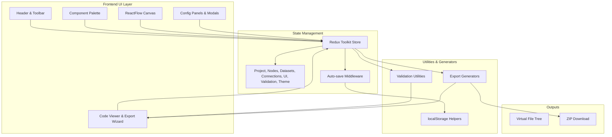
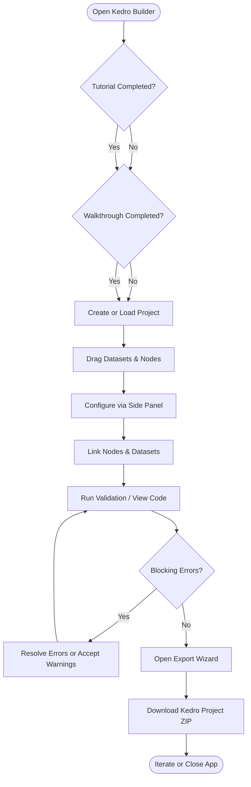
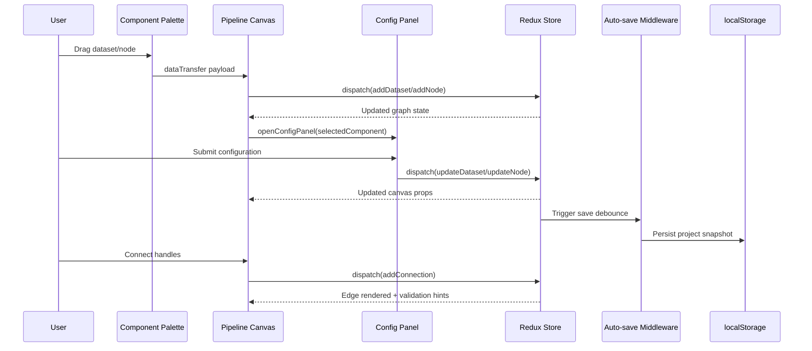

# Kedro Builder – Architecture & Technical Notes

> **Last Updated:** February 2026  
> **Status:** ✅ Visual builder, validation, and export complete | 🔄 Enhancements underway

---

## 📚 Table of Contents

1. [Project Overview](#project-overview)
2. [Technology Stack](#technology-stack)
3. [Key Architecture Decisions](#key-architecture-decisions)
4. [Architecture Overview](#architecture-overview)
5. [End-to-End User Flow](#end-to-end-user-flow)
6. [Component Interaction Sequence](#component-interaction-sequence)
7. [Code Generation Pipeline](#code-generation-pipeline)
8. [State Management & Data Flow](#state-management--data-flow)
9. [Validation & Export Implementation](#validation--export-implementation)
10. [Project Structure](#project-structure)
11. [Implementation Patterns](#implementation-patterns)
12. [Persistence & Onboarding](#persistence--onboarding)
13. [Performance & Accessibility Notes](#performance--accessibility-notes)
14. [Testing Strategy](#testing-strategy)
15. [Roadmap & Open Questions](#roadmap--open-questions)
16. [Reference Material](#reference-material)

---

## Project Overview

### Vision
Enable Kedro newcomers and data practitioners to build production-ready pipelines without writing boilerplate. Kedro Builder turns drag-and-drop diagrams into validated Kedro projects that can be inspected, downloaded, and run immediately.

### Delivered Capabilities
- Visual canvas (ReactFlow) with custom node/dataset components, bulk selection, keyboard shortcuts, and edge validation.
- Form-driven configuration for nodes (snake_case names, optional Python function bodies) and datasets (type presets, filepath builder, versioning toggle).
- Guided onboarding: five-step tutorial, contextual walkthrough overlays, empty state coaching, and enforced project setup.
- Auto-save middleware and theme/tutorial persistence via localStorage so users can resume work later.
- Validation pipeline that detects circular dependencies, duplicate/invalid names, orphaned components, and missing configuration.
- Code viewer with live Kedro project preview and export wizard that packages a full Kedro project ZIP (pyproject, conf, src, data directories, .gitignore).

### Target Users
- Data scientists and ML engineers experimenting with Kedro.
- Data engineers documenting ETL/ELT flows.
- Teams onboarding to Kedro and needing guided project scaffolding.

---

## Technology Stack

| Layer | Tools & Versions | Notes |
| --- | --- | --- |
| Runtime | React `19.1.1`, TypeScript `~5.9.3`, Vite `5.4.8` | Strict TS, fast dev feedback |
| State | Redux Toolkit `^2.9.0`, React-Redux | Normalized graph slices + UI slices |
| Canvas | `@xyflow/react` (ReactFlow) `^12.8.6` | Custom nodes, edges, selection tooling |
| UI | Radix UI primitives, Lucide icons, SCSS modules | BEM-style modules with theme variables |
| Forms | React Hook Form `^7.65.0` | Efficient form state for config panels |
| Export | JSZip `^3.10.1`, YAML/Handlebars-free TS templates | Pure TypeScript string templates; downloads via browser APIs |
| Feedback | react-hot-toast | Validation/export notifications |
| Testing | Vitest `^4.0.5`, Testing Library | Slice + generator unit tests |

Node.js `18.20.1` and npm `10+` are recommended for parity with local dev scripts.

---

## Key Architecture Decisions

1. **Normalized Redux Store**  
   Nodes, datasets, and connections follow the `{ byId, allIds }` pattern. This keeps lookups O(1), simplifies serialization, and reduces ReactFlow reconciliation cost.

2. **ID Prefix Strategy**  
   Generated IDs use `node-*`, `dataset-*`, and `connection-*`. Components infer entity type without extra metadata which streamlines selection, deletion, and validation.

3. **On-Demand Validation**  
   Validation runs when users open the code viewer/export wizard or when config changes during an export session. This avoids noisy real-time errors while keeping the export flow safe.

4. **Auto-Save Middleware**  
   A bespoke Redux middleware debounces write operations to localStorage, ensuring persistence without blocking the UI or spamming storage APIs.

5. **Template-Free Code Generation**  
   Instead of external template engines, TypeScript modules compose Kedro files directly. This keeps generation deterministic, typed, and testable.

6. **Guided Onboarding as Gatekeeping**  
   Canvas interactions stay disabled until a project exists; tutorial/walkthrough completion is persisted to avoid re-onboarding experienced users.

---

## Architecture Overview



---

## End-to-End User Flow



---

## Component Interaction Sequence



---

## Code Generation Pipeline

```mermaid
flowchart LR
    State[Redux State\n(nodes, datasets, connections, project)]
    Validate[validatePipeline()]
    Meta[Export Wizard Metadata\n(project name, package, pipeline)]
    Orchestrator[generateKedroProject()]
    Catalog[Generate catalog.yml]
    PipelineFiles[Generate nodes.py & pipeline.py]
    StaticFiles[Generate settings.py,\npipeline_registry.py, logging, etc.]
    Zip[Bundle with JSZip]
    Download[Trigger browser download]

    State --> Validate
    Validate -->|isValid| Orchestrator
    Meta --> Orchestrator
    Orchestrator --> Catalog
    Orchestrator --> PipelineFiles
    Orchestrator --> StaticFiles
    Catalog --> Zip
    PipelineFiles --> Zip
    StaticFiles --> Zip
    Zip --> Download
```

---

## State Management & Data Flow

1. **Initialization**  
   `useAppInitialization` inspects localStorage: it decides whether to show onboarding, restores saved projects, and hydrates Redux slices by replaying `addNode/addDataset/addConnection`.

2. **User Interaction Loop**  
   - Components dispatch slice actions (e.g., `nodesSlice.addNode`).  
   - Reducers update normalized state.  
   - Selectors and typed hooks (`useAppSelector`) keep ReactFlow and panels synced.  
   - ReactFlow callbacks (`onNodesChange`, `onConnect`) route through `useNodeHandlers` / `useConnectionHandlers` to produce Redux actions.

3. **Side Effects**  
   - Auto-save middleware debounces mutation-triggering actions defined in `SAVE_TRIGGER_ACTIONS`.  
   - `useValidation` listens for configuration changes during export and re-runs validation, pushing results into `validationSlice`.  
   - Toast notifications surface validation/export feedback.

---

## Validation & Export Implementation

- **Validation (`src/utils/validation.ts`)**  
  DFS-based cycle detection converts dataset connections into node-to-node edges. Additional passes enforce unique snake_case names, detect empty/orphaned nodes and datasets, and warn about missing node function code or dataset configuration.

- **Export Flow (`src/components/App/hooks/useValidation.ts`)**  
  `handleViewCode` and `handleExport` both run validation. The export wizard consumes `ValidationResult` state; when users confirm, `generateKedroProject` collects graph data and writes:  
  - `pyproject.toml`, `.gitignore`, `README.md`  
  - `conf/base` (catalog, logging, parameters) and `conf/local/credentials.yml`  
  - `src/<package>/` pipelines (`nodes.py`, `pipeline.py`, registry, settings)  
  - Data layer directories with `.gitkeep` placeholders.

- **Download**  
  The zip is generated client-side via JSZip and downloaded using a temporary `<a>` element with an object URL.

---

## Project Structure

```
kedro-builder/
├── src/
│   ├── components/
│   │   ├── App/                 # Shell, layout, validation hooks
│   │   ├── Canvas/              # ReactFlow integration, overlays, handlers
│   │   ├── CodeViewer/          # File tree + syntax-highlighted preview
│   │   ├── ConfigPanel/         # Node & dataset configuration forms
│   │   ├── ExportWizard/        # Validation step + metadata confirmation
│   │   ├── Palette/             # Drag sources for nodes/datasets
│   │   ├── ProjectSetup/        # Project creation/edit modal
│   │   ├── Tutorial/            # Onboarding modal
│   │   ├── UI/                  # Buttons, inputs, theme toggle, helpers
│   │   └── ValidationPanel/     # Issue list surfaced from validation slice
│   ├── features/                # Redux slices per domain
│   │   ├── connections/
│   │   ├── datasets/
│   │   ├── nodes/
│   │   ├── project/
│   │   ├── theme/
│   │   ├── ui/
│   │   └── validation/
│   ├── store/                   # Store configuration, typed hooks, middleware
│   ├── utils/
│   │   ├── export/              # Kedro project generators + tests
│   │   ├── localStorage.ts
│   │   ├── validation.ts
│   │   └── logger.ts
│   ├── styles/                  # Global styles & variables
│   ├── types/                   # Domain and Redux typings
│   ├── constants/               # Timing, layout, etc.
│   ├── services/                # (Reserved for future external services)
│   └── main.tsx                 # App entry point
├── public/                      # Static assets
├── README.md                    # Quick start & usage
├── PROJECT_ARCHITECTURE.md      # This document
└── package.json / tsconfig / vite.config.ts
```

---

## Implementation Patterns

```typescript
// Debounced auto-save middleware (src/store/middleware/autoSaveMiddleware.ts)
const SAVE_TRIGGER_ACTIONS = [
  'project/createProject',
  'project/updateProject',
  'nodes/addNode',
  // ...additional mutation actions
];

export const autoSaveMiddleware: Middleware<{}, RootState> = store => next => action => {
  const result = next(action);
  if (shouldTriggerSave(action)) {
    clearTimeout(saveTimeout);
    saveTimeout = setTimeout(() => {
      saveProjectToLocalStorage(store.getState());
      logger.save('Project auto-saved to localStorage');
    }, TIMING.AUTO_SAVE_DEBOUNCE);
  }
  return result;
};
```

```typescript
// Validation hook orchestrating code preview/export (src/components/App/hooks/useValidation.ts)
const { exportValidationResult, handleViewCode, handleExport, handleConfirmExport } =
  useValidation({ showExportWizard });
```

```typescript
// Node configuration name guard (src/components/ConfigPanel/NodeConfigForm/NodeConfigForm.tsx)
if (!/^[a-z][a-z0-9_]*$/.test(trimmed)) {
  return 'Must start with lowercase letter and contain only lowercase letters, numbers, and underscores';
}
```

---

## Persistence & Onboarding

- `useAppInitialization` determines whether to show the tutorial or walkthrough based on `kedro_builder_tutorial_completed` and `kedro_builder_walkthrough_completed` flags.  
- If a serialized project exists under `kedro_builder_current_project`, the store is hydrated before the UI renders.  
- Tutorial/walkthrough/theme preferences, the active project, and pipeline graph state are all stored in localStorage so the app resumes exactly where a user left off.

---

## Performance & Accessibility Notes

- ReactFlow interactions are memoized; expensive UI components use `React.memo` and `useCallback`.  
- Validation runs off the UI thread except for the final Redux dispatch, keeping the canvas responsive.  
- Radix UI ensures focus trapping and ARIA labelling for modals.  
- Theme switching relies on CSS custom properties to avoid repaint-heavy DOM mutations.  
- Future considerations: virtualize massive pipelines, migrate persistence to IndexedDB (Dexie dependency placeholder), and offload validation to a worker for very large graphs.

---

## Testing Strategy

- **Implemented:**  
  - Vitest unit tests for validation helpers and export generators.  
  - Slice reducer tests covering node/dataset/connection mutations.

- **Planned Enhancements:**  
  - Integration tests simulating canvas interactions with Testing Library.  
  - Playwright end-to-end flows (project creation → export).  
  - Accessibility audits (axe) and Lighthouse checks.  
  - Snapshot or DOM-diff tests for core modals.

---

## Roadmap & Open Questions

| Theme | Planned Enhancements | Notes |
| --- | --- | --- |
| Templates | Pre-built Kedro pipeline templates, template gallery | Requires UX for preview + insertion |
| Editing UX | Undo/redo stack, minimap, search/filter, zoom presets | Redux middleware + ReactFlow extensions |
| Collaboration | Import/export JSON, shareable links, team workflows | Likely needs IndexedDB/Dexie or backend |
| Validation | Type-aware dataset compatibility, parameter coverage | Extend `validatePipeline` with schema info |
| Persistence | Migrate autosave to IndexedDB for large projects | Dexie dependency already available |
| Deployment | Hosted demo, documentation site, GitHub Pages | Align with README quick start |

Open questions: How should dataset type compatibility be modelled (mapping table vs plugin system)? Do we need multi-pipeline support within one project? What does collaboration look like (local file vs remote)?

---

## Reference Material

- `README.md` – Quick start, feature highlights, dev scripts.  
- `src/utils/export/*.ts` – Source of project generation logic.  
- `src/utils/validation.ts` – Validation rules discussed above.  
- `src/store/middleware/autoSaveMiddleware.ts` – Persistence implementation.  
- `src/components/App/hooks/useValidation.ts` – Export orchestration glue.

---

**Built with AI assistance.**

