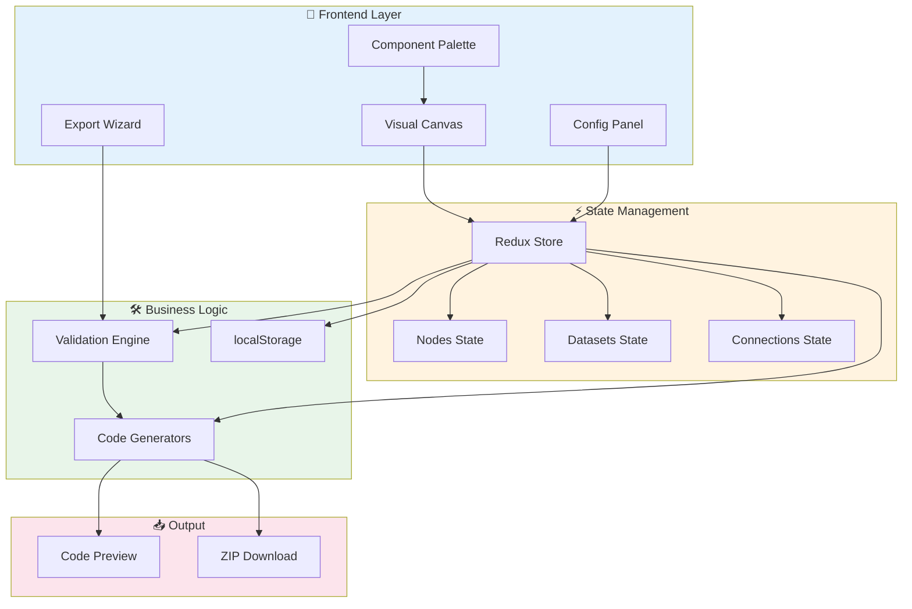
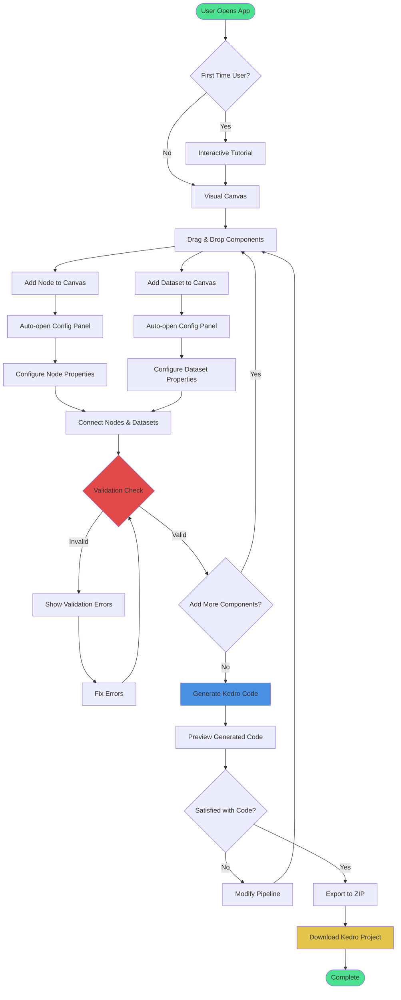
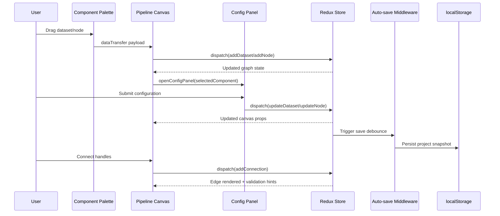
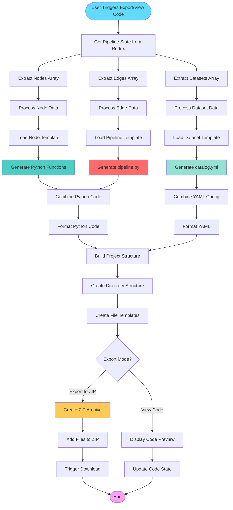

# Kedro Builder – Architecture & Technical Notes

## 📚 Table of Contents

1. [Project Overview](#project-overview)
2. [Technology Stack](#technology-stack)
3. [Key Architecture Decisions](#key-architecture-decisions)
4. [Architecture Overview](#architecture-overview)
5. [User Flow Diagram](#user-flow-diagram)
6. [Data Flow Diagram](#data-flow-diagram)
7. [Code Generation Flow](#code-generation-flow)
8. [State Management & Data Flow](#state-management--data-flow)
9. [Validation & Export Implementation](#validation--export-implementation)
10. [Project Structure](#project-structure)
11. [Implementation Patterns](#implementation-patterns)
12. [Testing Strategy](#testing-strategy)

---

## Project Overview

Enable Kedro newcomers and data practitioners to build production-ready pipelines without writing boilerplate. Kedro Builder turns drag-and-drop diagrams into validated Kedro projects that can be inspected, downloaded, and run immediately.

---

## Technology Stack

| Layer | Tools & Versions | Notes |
| --- | --- | --- |
| Runtime | React `19.1.1`, TypeScript `~5.9.3`, Vite `5.4.8` | Strict TS, fast dev feedback |
| State | Redux Toolkit `^2.9.0`, React-Redux | Normalized graph slices + UI slices |
| Canvas | `@xyflow/react` (ReactFlow) `^12.8.6` | Custom nodes, edges, selection tooling |
| UI | Radix UI primitives, Lucide icons, SCSS modules | BEM-style modules with theme variables |
| Forms | React Hook Form `^7.65.0` | Efficient form state for config panels |
| Export | JSZip `^3.10.1`, YAML/Handlebars-free TS templates | Pure TypeScript string templates; downloads via browser APIs |
| Feedback | react-hot-toast | Validation/export notifications |
| Testing | Vitest `^4.0.5`, Testing Library | Slice + generator unit tests |

Node.js `18.20.1` and npm `10+` are recommended for parity with local dev scripts.

---

## Key Architecture Decisions

1. **Normalized Redux Store**
   Nodes, datasets, and connections follow the `{ byId, allIds }` pattern. This keeps lookups O(1), simplifies serialization, and reduces ReactFlow reconciliation cost.

2. **ID Prefix Strategy**
   Generated IDs use `node-*`, `dataset-*`, and `connection-*`. Components infer entity type without extra metadata which streamlines selection, deletion, and validation. Type guards (`isNodeId()`, `isDatasetId()`) provide runtime safety.

3. **On-Demand Validation**
   Validation runs when users open the code viewer/export wizard or when config changes during an export session. This avoids noisy real-time errors while keeping the export flow safe.

4. **Auto-Save Middleware**
   A bespoke Redux middleware debounces write operations to localStorage, ensuring persistence without blocking the UI or spamming storage APIs. Includes graceful degradation for quota exceeded and storage unavailable scenarios.

5. **Template-Free Code Generation**
   Instead of external template engines, TypeScript modules compose Kedro files directly. This keeps generation deterministic, typed, and testable.

6. **Guided Onboarding as Gatekeeping**
   Canvas interactions stay disabled until a project exists; tutorial/walkthrough completion is persisted to avoid re-onboarding experienced users.

7. **Domain Layer Separation**
   Framework-agnostic business logic (ID generation, graph traversal, cycle detection) is isolated in `src/domain/`. This makes the core logic testable without React/Redux dependencies.

8. **Branded ID Types**
   TypeScript branded types (`NodeId`, `DatasetId`, `ConnectionId`) prevent accidental ID type mixing at compile time while remaining compatible with plain strings at runtime.

9. **Error Boundaries**
   React Error Boundaries wrap critical UI sections (Canvas, ConfigPanel, CodeViewer, ExportWizard) to prevent cascading failures and provide recovery options.


## Architecture Overview



---

## User Flow Diagram



---

## Data Flow Diagram



---

## Code Generation Flow



---

## State Management & Data Flow

Kedro Builder uses **Redux Toolkit** with a **normalized state structure** for efficient lookups and updates. The state is organized into domain-specific slices, with middleware handling persistence and side effects.

### Key Implementation Details

1. **Initialization**  
   `useAppInitialization` inspects localStorage: it decides whether to show onboarding, restores saved projects, and hydrates Redux slices by replaying `addNode/addDataset/addConnection`.

2. **User Interaction Loop**  
   - Components dispatch slice actions (e.g., `nodesSlice.addNode`).  
   - Reducers update normalized state.  
   - Selectors and typed hooks (`useAppSelector`) keep ReactFlow and panels synced.  
   - ReactFlow callbacks (`onNodesChange`, `onConnect`) route through `useNodeHandlers` / `useConnectionHandlers` to produce Redux actions.

3. **Side Effects**  
   - Auto-save middleware debounces mutation-triggering actions defined in `SAVE_TRIGGER_ACTIONS`.  
   - `useValidation` listens for configuration changes during export and re-runs validation, pushing results into `validationSlice`.  
   - Toast notifications surface validation/export feedback.

4. **Normalized State Benefits**
   - O(1) lookups by ID
   - Efficient updates (no array scanning)
   - Easy serialization for localStorage
   - Simplified ReactFlow reconciliation

5. **ID Prefix Strategy**
   - `node-*`: Function nodes
   - `dataset-*`: Dataset nodes
   - `connection-*`: Edges between nodes and datasets
---

## Validation & Export Implementation

- **Pipeline Validation (`src/utils/validation/`)**
  Modular validator classes following the Strategy pattern. Each validator (CircularDependency, DuplicateName, EmptyName, InvalidName, OrphanedNode, OrphanedDataset, MissingCode, MissingConfig) implements a common `Validator` interface. The `ValidatorRegistry` exposes three methods: `register`, `getAll`, and `validateAll`. Shared helpers like `getConnectionsArray` are extracted to `validators/helpers.ts`. The `PipelineGraph` domain service handles DFS-based cycle detection by converting dataset connections into node-to-node edges.

- **Input Validation (`src/utils/validation/inputValidation.ts`)**
  Real-time validation for node/dataset names with snake_case enforcement, Python keyword detection, and length limits.

- **Export Flow (`src/components/App/hooks/useValidation.ts`)**
  `handleViewCode` and `handleExport` both run validation and store results in Redux. When the export wizard opens, it reads validation results from Redux state (avoiding redundant re-validation). When users confirm, `generateKedroProject` (in `KedroProjectBuilder.ts`) collects graph data and writes:
  - `pyproject.toml`, `.gitignore`, `README.md`
  - `conf/base` (catalog, logging, parameters) and `conf/local/credentials.yml`
  - `src/<package>/` pipelines (`nodes.py`, `pipeline.py`, registry, settings)
  - Data layer directories with `.gitkeep` placeholders.

- **Code Generation (`src/infrastructure/export/`)**
  TypeScript modules compose Kedro files directly without external template engines. Includes generators for catalog, nodes, pipeline, pyproject, registry, and static files.

- **Download**
  The zip is generated client-side via JSZip and downloaded using a temporary `<a>` element with an object URL.

---

## Project Structure

```
kedro-builder/
├── src/
│   ├── domain/                  # Framework-agnostic business logic
│   │   ├── IdGenerator.ts       # Centralized ID generation with type guards
│   │   ├── PipelineGraph.ts     # Graph building, cycle detection, orphan finding
│   │   └── index.ts             # Barrel exports
│   ├── infrastructure/          # External service integrations
│   │   ├── export/              # Kedro project generators, helpers, tests
│   │   │   ├── KedroProjectBuilder.ts  # ZIP generation + download
│   │   │   └── helpers.ts       # Shared export utilities (snake_case, formatting)
│   │   ├── localStorage/        # Persistence with validation & graceful degradation
│   │   └── telemetry/           # Heap analytics (uses centralized STORAGE_KEYS)
│   ├── components/
│   │   ├── App/                 # Shell, layout, validation hooks
│   │   ├── Canvas/              # ReactFlow integration, overlays, handlers
│   │   ├── CodeViewer/          # File tree + syntax-highlighted preview
│   │   ├── ConfigPanel/         # Node & dataset configuration forms
│   │   ├── ExportWizard/        # Validation step + metadata confirmation
│   │   ├── Palette/             # Drag sources for nodes/datasets
│   │   ├── ProjectSetup/        # Project creation/edit modal
│   │   ├── Tutorial/            # Onboarding modal
│   │   ├── UI/                  # Buttons, inputs, theme toggle, ErrorBoundary
│   │   └── ValidationPanel/     # Issue list surfaced from validation slice
│   ├── features/                # Redux slices per domain
│   │   ├── canvas/              # Combined canvas selectors with Set optimizations
│   │   ├── connections/
│   │   ├── datasets/
│   │   ├── nodes/
│   │   ├── project/
│   │   ├── theme/
│   │   ├── ui/                  # UI slice + selectors
│   │   └── validation/          # Validation slice + indexed selectors
│   ├── hooks/                   # Custom React hooks
│   │   ├── useConfirmDialog.ts  # Reusable confirm dialog state
│   │   ├── useClearSelections.ts # Clear all selections
│   │   ├── useSelectAndOpenConfig.ts # Select + open config panel
│   │   └── useTelemetry.ts      # Telemetry tracking hook
│   │   # Canvas-specific hooks in components/Canvas/hooks/:
│   │   #   useDeleteItems.ts    # Shared delete logic for nodes/datasets/edges
│   ├── store/                   # Store configuration, typed hooks, middleware
│   ├── utils/
│   │   ├── validation/          # Validator classes (Strategy pattern)
│   │   │   ├── validators/      # Individual validators + shared helpers
│   │   │   ├── inputValidation.ts  # Real-time input validation
│   │   │   ├── pipelineValidation.ts  # ValidatorRegistry wrapper
│   │   │   └── types.ts         # Canonical ValidationError type
│   │   ├── fileTreeGenerator.ts # Code viewer file tree (FileTreeInput interface)
│   │   ├── logger.ts            # Centralized logger (WARN in prod, DEBUG in dev)
│   │   └── filepath.ts
│   ├── styles/                  # Global styles & variables
│   ├── types/                   # Domain and Redux typings
│   │   └── ids.ts               # Branded ID types (NodeId, DatasetId, ConnectionId)
│   ├── constants/               # Timing, layout, etc.
│   └── main.tsx                 # App entry point
├── public/                      # Static assets
├── README.md                    # Quick start & usage
├── PROJECT_ARCHITECTURE.md      # This document
├── CONTRIBUTING.md              # Setup, code standards, PR guidelines
├── CHANGELOG.md                 # Keep a Changelog format
└── package.json / tsconfig / vite.config.ts
```

---

## Implementation Patterns

### Centralized ID Generation (src/domain/IdGenerator.ts)
```typescript
// Type-safe ID generation with runtime guards
export const generateId = (type: 'node' | 'dataset' | 'connection'): string => {
  const timestamp = Date.now();
  return `${type}-${timestamp}`;
};

export const isNodeId = (id: string): boolean => id.startsWith('node-');
export const isDatasetId = (id: string): boolean => id.startsWith('dataset-');
```

### Branded ID Types (src/types/ids.ts)
```typescript
// Compile-time type safety for IDs
type Brand<T, B> = T & { __brand: B };
export type NodeId = Brand<string, 'NodeId'>;
export type DatasetId = Brand<string, 'DatasetId'>;

// Safe casters with runtime validation
export const asNodeId = (id: string): NodeId => {
  if (!id.startsWith('node-')) throw new Error(`Invalid NodeId: ${id}`);
  return id as NodeId;
};
```

### Debounced Auto-save Middleware (src/store/middleware/autoSaveMiddleware.ts)
```typescript
const SAVE_TRIGGER_ACTIONS = [
  'project/createProject',
  'nodes/addNode',
  // ...additional mutation actions
];

export const autoSaveMiddleware: Middleware<{}, RootState> = store => next => action => {
  const result = next(action);
  if (shouldTriggerSave(action)) {
    clearTimeout(saveTimeout);
    saveTimeout = setTimeout(() => {
      saveProjectToLocalStorage(store.getState());
    }, TIMING.AUTO_SAVE_DEBOUNCE);
  }
  return result;
};
```

### Optimized Selectors with Set-based Lookups (src/features/canvas/canvasSelectors.ts)
```typescript
// Combined selector with Set provides O(1) selection checks
// Theme is selected separately to avoid invalidating node/edge memoization on toggle
export const selectCanvasData = createSelector(
  [selectAllNodes, selectAllDatasets, selectSelectedNodeIds, selectSelectedEdgeIds],
  (nodes, datasets, selectedNodeIds, selectedEdgeIds) => ({
    nodes,
    datasets,
    selectedNodeIdsSet: new Set(selectedNodeIds),
    selectedEdgeIdsSet: new Set(selectedEdgeIds),
  })
);
```

### Input Validation (src/utils/validation/inputValidation.ts)
```typescript
export const validateNodeName = (name: string): ValidationResult => {
  if (!name.trim()) return { valid: false, error: 'Name is required' };
  if (!/^[a-z][a-z0-9_]*$/.test(name)) {
    return { valid: false, error: 'Must be snake_case starting with lowercase letter' };
  }
  if (PYTHON_KEYWORDS.has(name)) {
    return { valid: false, error: 'Cannot use Python keyword as name' };
  }
  return { valid: true };
};
```

### Error Boundary Usage (src/components/App/AppLayout.tsx)
```typescript
<ErrorBoundary componentName="Canvas">
  <PipelineCanvas />
</ErrorBoundary>
```

---

## Testing Strategy

**340 tests** across 18 test files, **64%+ coverage** (all refactored code 95-100%).

- **Unit Tests (Vitest + Testing Library)**
  - Custom hooks tests (`hooks/hooks.test.tsx` — 12 tests)
  - Domain logic tests (`domain/PipelineGraph.test.ts` — 27 tests)
  - Validator class tests (`validators/validators.test.ts` — 41 tests)
  - Export generator tests (`catalogGenerator.test.ts` — 33, `nodesGenerator.test.ts` — 19, `pipelineGenerator.test.ts` — 10, `helpers.test.ts` — 41)
  - Utility tests (`filepath.test.ts` — 23 tests, `fileTreeGenerator.test.ts` — 21 tests)
  - Slice reducer tests covering node/dataset/connection mutations (14 each)

- **Integration Tests**
  - Pipeline create → connect → export flow
  - Pipeline create → validate flow

- **Contract Tests**
  - ID format contracts (`idFormats.contracts.test.ts`)
  - localStorage key contracts (`localStorage.contracts.test.ts`)
  - Event name contracts (`events.contracts.test.ts`)

- **Test Infrastructure**
  - Mock store utilities (`src/test/utils/mockStore.ts`)
  - Test fixtures (`src/test/fixtures/`)
  - Custom render wrapper with Redux provider (`src/test/utils/testUtils.tsx`)

- **Coverage Areas**
  - Domain logic (ID generation, graph operations)
  - Validation rules (all 8 validator classes)
  - Code generation (all Kedro file generators)
  - Redux slice reducers
  - Custom hooks (100% coverage)

---

**Built with AI assistance.**

